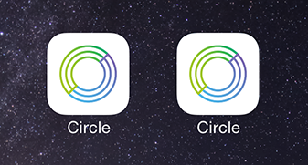
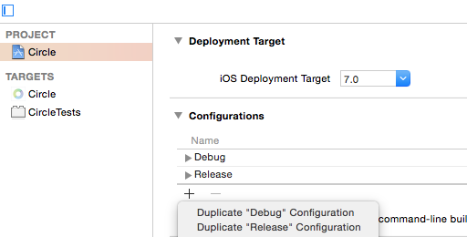
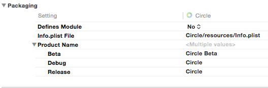
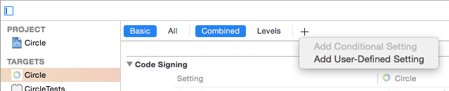
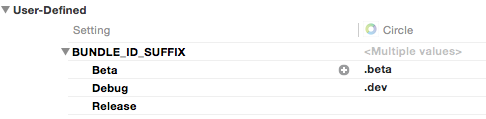
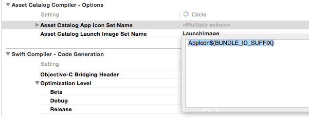
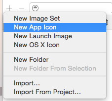
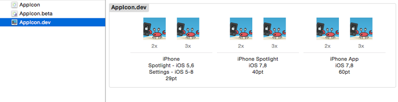
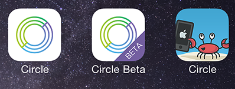

### Different App Icons for your iOS Beta, Dev, and Release builds

You’ve got an app in the App Store. You want to keep iterating upon it. You also want to test it in the wild before releasing updates to your userbase. Sound familiar?

If you’ve done this before, you know you’ll want to have a beta version of your app, and you want to run it alongside your “App Store” and development builds. But, unless you take some time to set things up, your homescreen will start looking like this:

Which one’s which? 
Turns out, this is a pretty simple problem to solve in Xcode

**Make a beta**

First, if you haven’t already set up a Beta build, you should do that now. 
In Xcode, click on your project, and click on your project on the top of the left pane. Be sure the project is selected in the top left — not your Target. 
On the Info tab, click the “+” Sign under “Configurations” and select “Duplicate ‘Release’ Configruation” 
Name this configuration “Beta”

As of now, you’ll be able to build Debug, Beta, and Release builds. But they all have the same name. Let’s fix that. 

**Give your apps a name**

While you’re in your project settings, select your Target from the left sidebar and go to the “Build Settings” tab. 
In the “Packaging” section of your Build Settings, expand the “Product Name” field. (If you can’t find it, just search in the top right bar) 
In each of the configurations, give your app a new name. 
We found it useful to keep Debug and Release named “Circle” and to only name the “Beta” build, since Beta would be used by external people (and we can have more fun with our “Debug” icon to distinguish it).

So far so good. But now, every time we run our Dev or Beta build, it overwrites our Release build from the App Store. Not ideal for field testing. 
The next step is to make it so we can run these apps side-by-side.
On the top bar, click the + sign and “Add User-Defined Setting”

Name it BUNDLE_ID_SUFFIX (or something similar — you’ll need to re-use this name later) 
Open the dropdown and give the following values for each configuration, leaving the “Release” value blank:

Now open up Info.plist and locate the “Bundle Identifier” setting. Edit it and append ${BUNDLE_ID_SUFFIX} to your existing bundle id. For example, if your bundle id is com.crab.awesome, you’d change it to com.crab.awesome${BUNDLE_ID_SUFFIX} 
Notice how we’re using the BUNDLE_ID_SUFFIX you just created? This makes it so you’ll have 3 bundle identifiers automatically — com.crab.awesome for Release, com.crab.awesome.dev for Debug, and com.crab.awesome.beta for Beta.

**Iconify!**

OK, now it’s time for the fun: setting a unique App Icon for each of your builds. 
Go back to your project settings, select your Target, and choose “Build Settings” Under “Asset Catalog Compiler — Options”, find the “Asset Catalog App Icon Set Name” setting. 
Don’t expand this one, just set the value to be AppIcon${BUNDLE_ID_SUFFIX}.

Again, notice how we’re using BUNDLE_ID_SUFFIX here. This makes it so the build process will look for an app icon named AppIcon.beta during Beta builds, AppIcon.dev during Debug builds and plain-old AppIcon during Release builds. 
NOTE: You may also see the “Asset Catalog Launch Image Set Name” below this setting. You could also do the same thing here if you wanted different launch images per build type. 
That was easy. But we’re not done just yet. There’s one more step: You have to add the icons to your app. 
Open your Images.xcassets file. Click the + on the bottom left, and select “New App Icon”. Name it AppIcon.dev. Do it again for AppIcon.beta (notice a theme here?)

Now fill these in with icons (we like using the App Icon Template from PixelResort). 
Most importantly, be sure to have fun with the development one.

And voila — you now have different apps running along side eachother with different icons.

